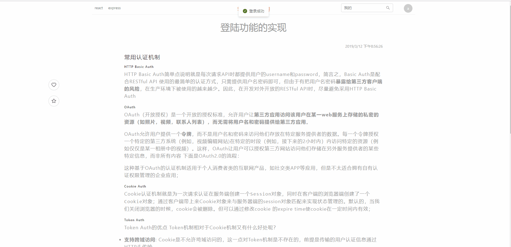
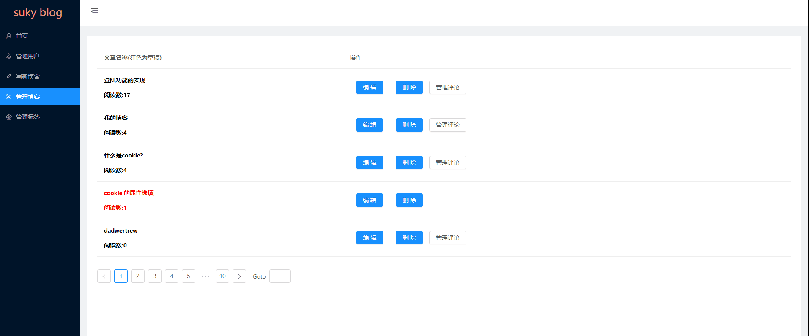

### **React + Express + Mongodb + antd 全栈博客**

###### 所用技术栈：
环境搭建： 
+ Express
+ create-react-app
+ @babel/plugin-proposal-decorators(使用装饰器)
+ customize-cra(装饰器辅助组件)
+ antd
+ http-proxy-middleware(支持create-react-app跨域)
+ babel-plugin-import(antd辅助插件)
+ nodemon

搭建过程(主要组件)：
+ axios
+ cookie-parser
+ express-session
+ mongoose
+ multer
+ react
+ react-dom
+ redux
+ redux-saga
+ remark(markdown处理)
+ socket.io
+ react-responsive(响应式)

##### 主要效果图
登录过程：

搜索：

具体页面：

响应式(管理页面没有响应)： 

编辑便签：

编辑博客：

新增博客：

编辑用户：

配置：
1. 复制
> git clone https://github.com/hellosuky/blog.git

2. 依赖包安装
> npm install
3. 运行
> npm run start

 
http://localhost:3000 为前端,http://localhost:3000/admin 为管理

>npm run dev

http://localhost:9090 为后端接口
